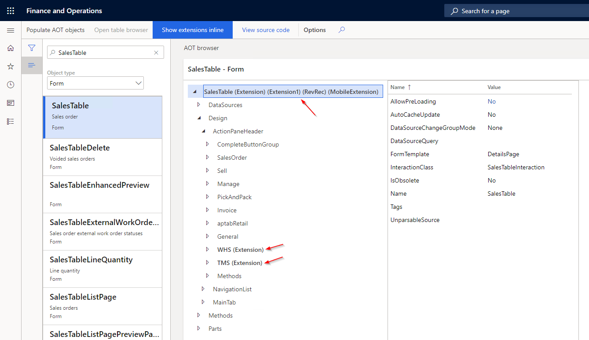
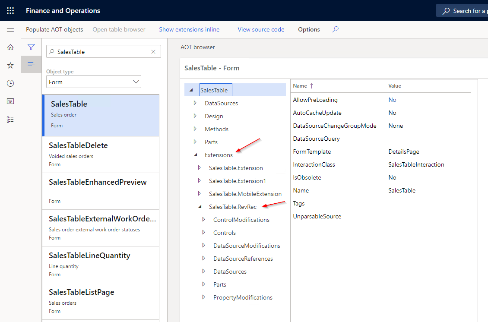

# View Extensions Inline

## Viewing extensions inline

At the top of the AOT browser form is a toggle button to turn on or off the ability to view the extensions inline in the tree. The setting will be remembered in the user's usage data once the form is closed.

When enabled, extensions will be shown in the tree where they belong. They are bolded and have the name of the extension they belong to in parenthesis after the name.

## Viewing extensions as separate node

When the toggle is disabled, the extensions show up as a separate node at the bottom of the tree.

