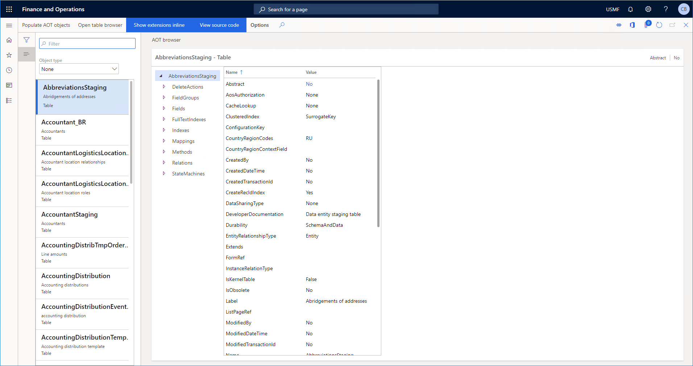

# AOT Browser

_Dynamics 365 for Finance and Operations AOT Browser_

## What is the AOT Browser?

In Dynamics AX 2012 and earlier it was possible for power users to be able to open and browse the contents of the AOT
(Application Object Tree) from the UI. This functionality was removed in Dynamics 365 for Finance and Operations as all
development is now done in Visual Studio. This means that in order to browse the contents of the AOT, one now needs access
to a development environment with Visual Studio.

**AOT Browser to save the day!** With the AOT Browser it is now possible to browse the objects in the AOT from the D365FO web interface.

## Getting Started

### Download

Both a deployable package and a model file are available in
[Releases](https://github.com/arbelatech/aotbrowser/releases)

### How do I get to the AOT Browser?

In the D365FO web interface navigate to Common > Common > AOT browser

### Populate list of AOT objects

It is necessary to populate the list of AOT objects after installing AOT Browser. This is acheived
by clicking the Populate AOT objects button. It is recommended to run this as a batch job as it can take
several minutes to complete. It is also recommended to schedule the batch job with recurrance so that the
list is up-to-date with all of the objects in the AOT.

## Features

- [Search/Filter](search.md)
  - By AOT name or by label name
  - By object type
- [Open from form personalization screen](openform.md)
- [Open from data entities form](openentity.md)
- [Open in table browser (tables/views)](tablebrowser.md)
- [View extensions inline](extensionsinline.md)
- [View source code](viewcode.md)
- [Jump to references](jumpreferences.md)
- View label value instead of label id
