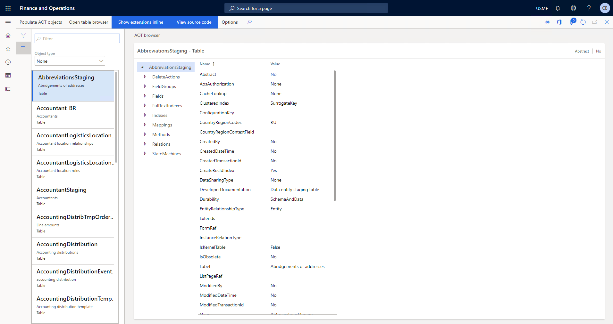

# AOT Browser

_Dynamics 365 for Finance and Operations AOT Browser_

## What is the AOT Browser?

In Dynamics AX 2012 and earlier it was possible for power users to be able to open and browse the contents of the AOT
(Application Object Tree) from the UI. This functionality was removed in Dynamics 365 for Finance and Operations as all
development is now done in Visual Studio. This means that in order to browse the contents of the AOT, one now needs access
to a development environment with Visual Studio.

**AOT Browser to save the day!** With the AOT Browser it is now possible to browse the objects in the AOT from the D365FO web interface.

## Getting Started

### Download

Both a deployable package and a model file are available in
[Releases](https://github.com/arbelatech/aotbrowser/releases)

### How do I get to the AOT Browser?

In the D365FO web interface navigate to Common > Common > AOT browser

### Populate data

After installing AOT Browser it is necessary to populate data by running two batch jobs:

1. **Populate AOT objects** — From the AOT Browser form, click the **Populate AOT objects** button. This populates the searchable list of AOT objects. It is recommended to run this as a batch job as it can take several minutes to complete.

2. **Populate table metadata** — From the Table metadata form (**Common > Common > Table metadata**), click the **Populate table metadata** button. This populates the [table and enum metadata](tablemetadata.md) used by AI agents and OData consumers.

It is recommended to schedule both batch jobs with recurrence so that the data stays up-to-date with changes to the AOT.

## Features

- [Search/Filter](search.md)
  - By AOT name or by label name
  - By object type
- [Open from form personalization screen](openform.md)
- [Open from data entities form](openentity.md)
- [Open in table browser (tables/views)](tablebrowser.md)
- [View extensions inline](extensionsinline.md)
- [View source code](viewcode.md)
- [Jump to references](jumpreferences.md)
- [Table and enum metadata](tablemetadata.md)
- View label value instead of label id
