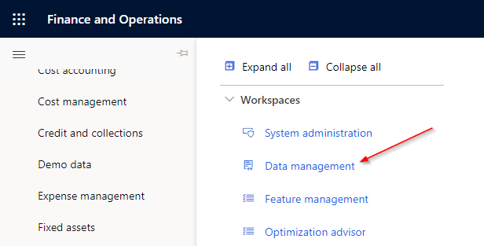
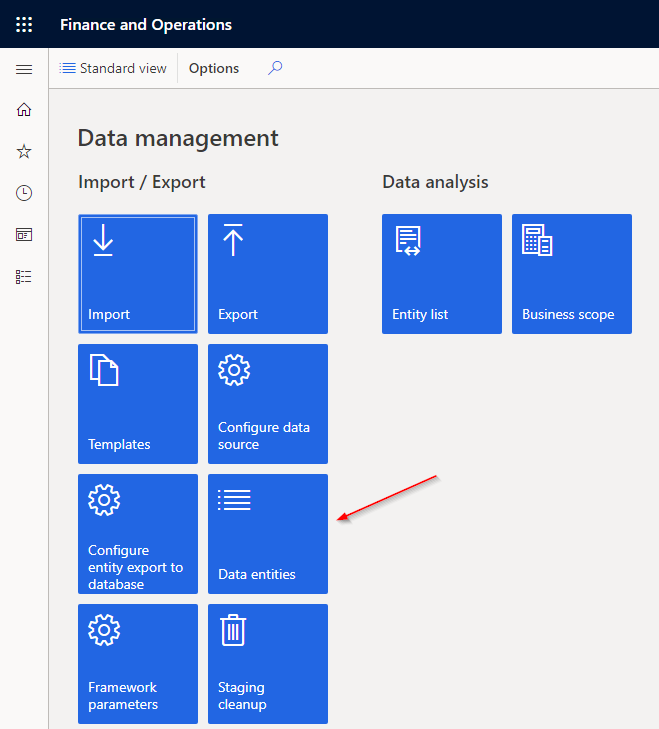
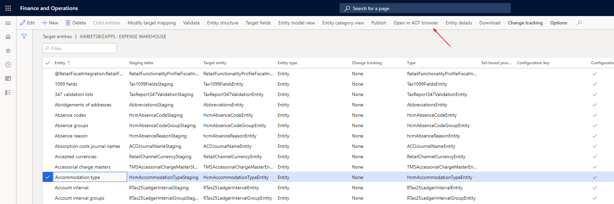
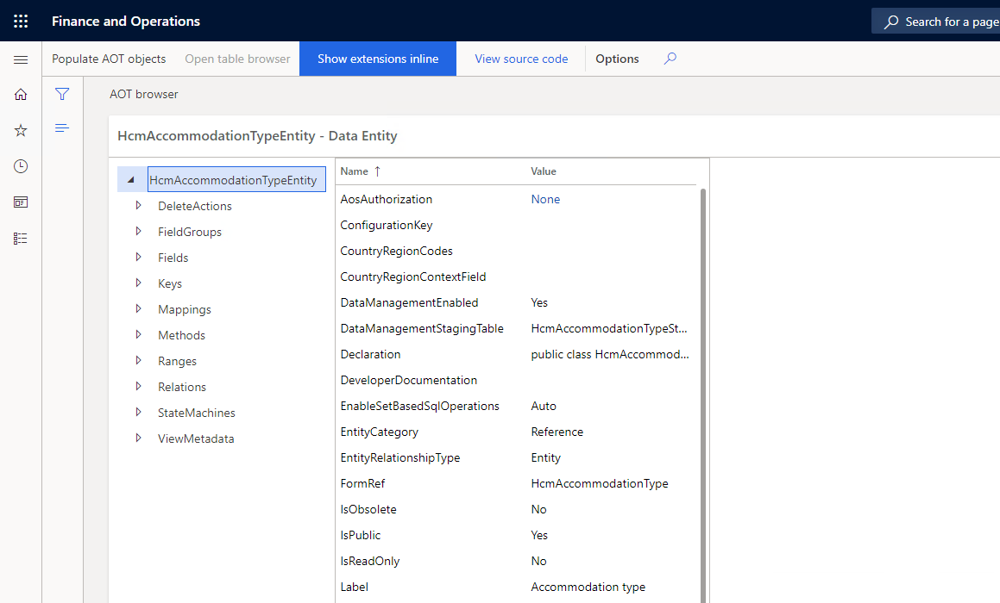

# Open from Data Entities Form

## 1. Navigate to System Administration > Workspaces > Data management

## 2. Select the Data entities tile

## 3. Select the entity you want to browse and click "Open in AOT browser" at the top

## 4. The AOT Browser will open and display the data entity

