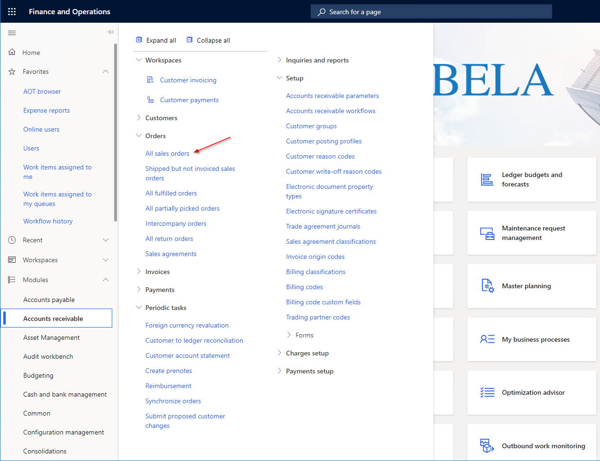
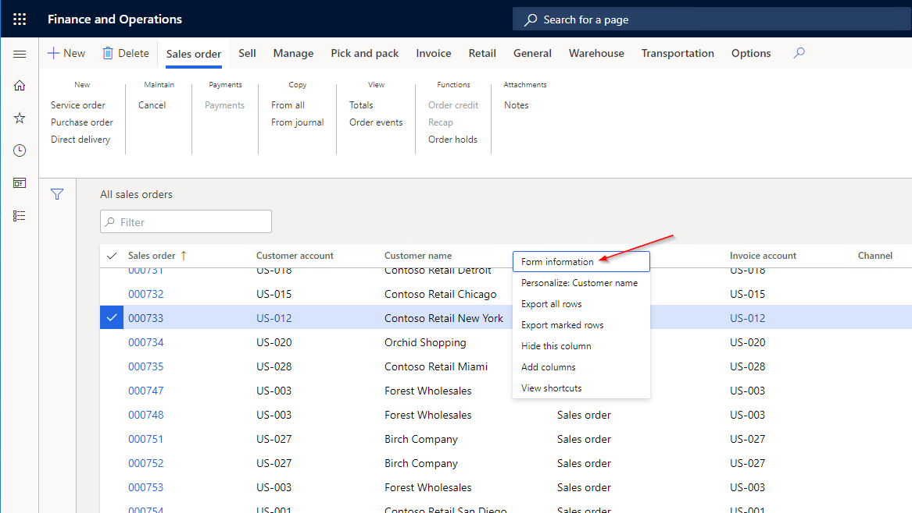
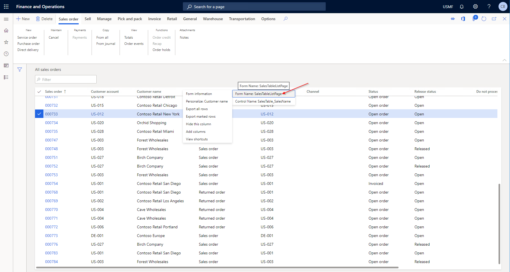
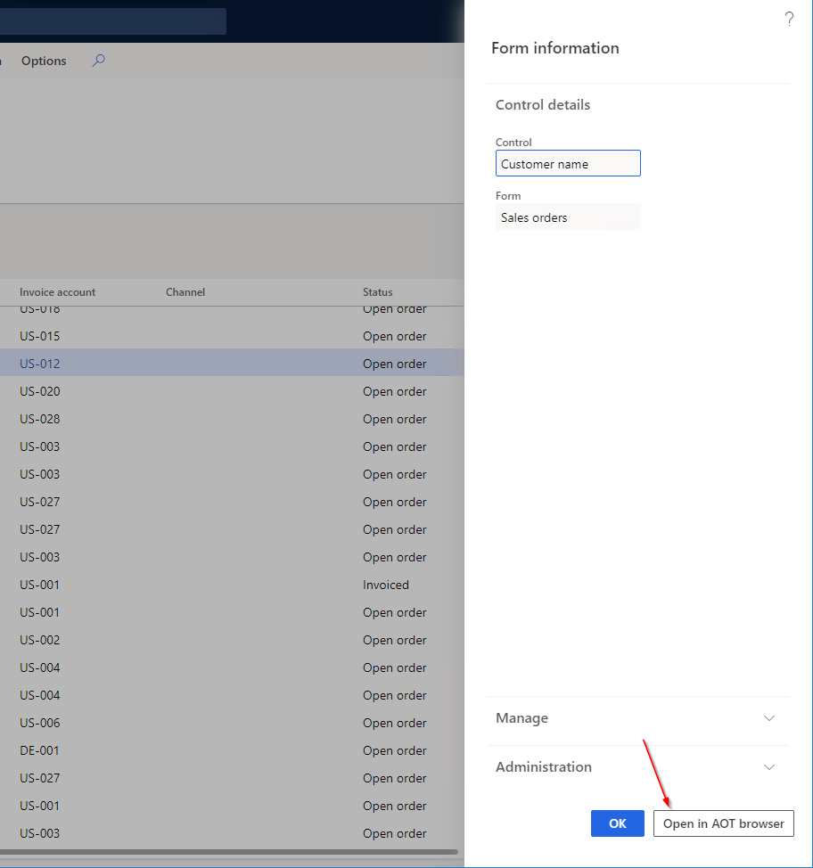
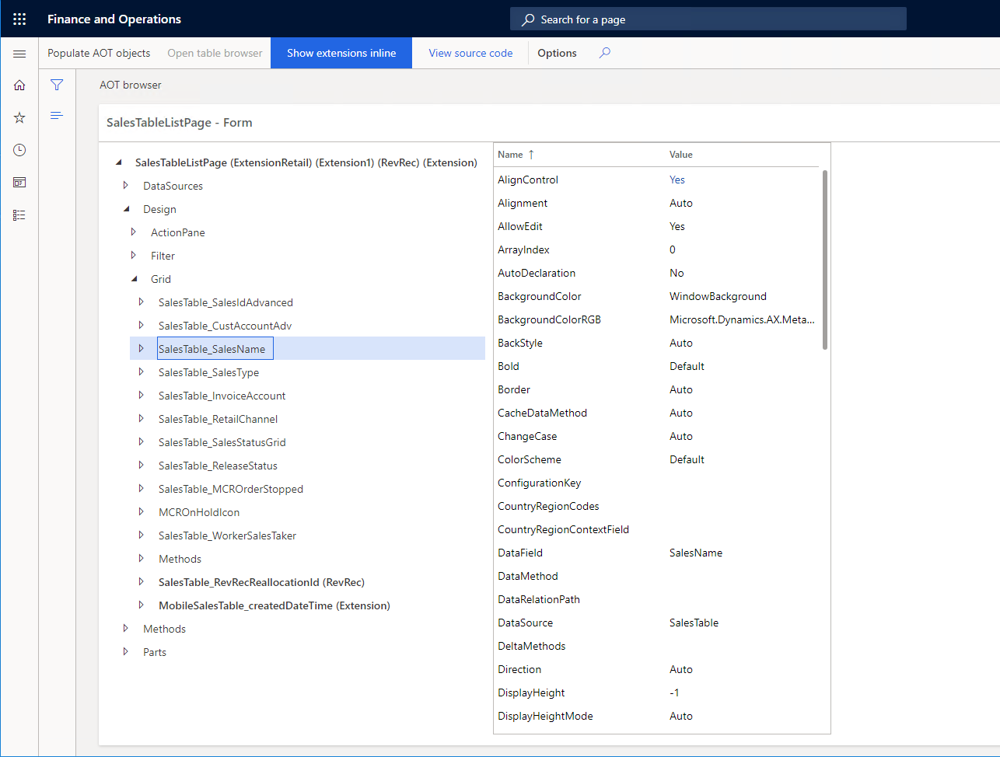

# Open from Form Personalization

## 1. Open the form in the web UI that you would like to browse

## 2. Right click on any element of the form and select form information

## 3. Click on the form name

## 4. At the bottom of the dialog click "Open in AOT browser"

## 5. The AOT browser will open for the form and select the control that was right-clicked in the calling form

