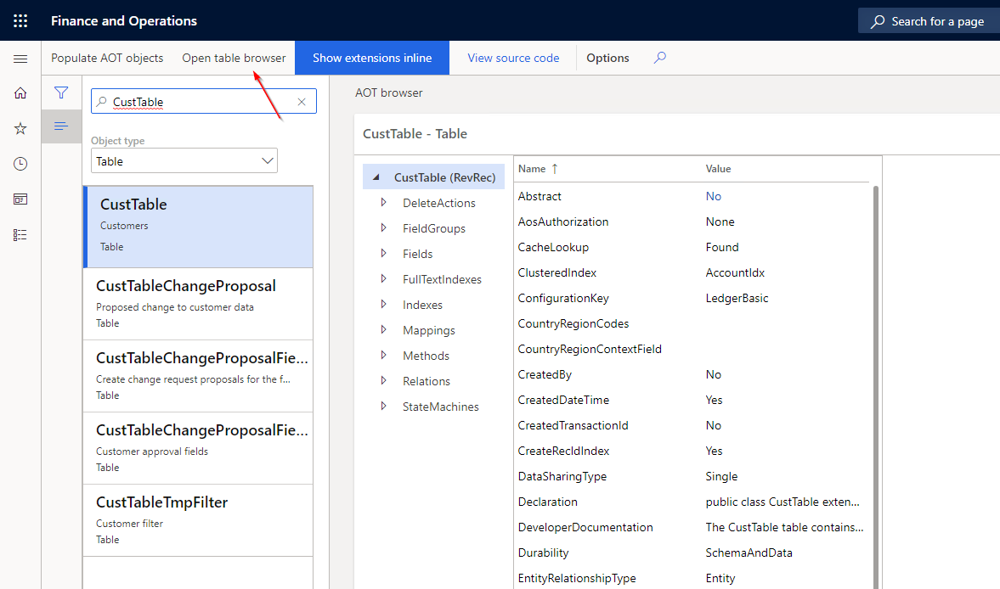
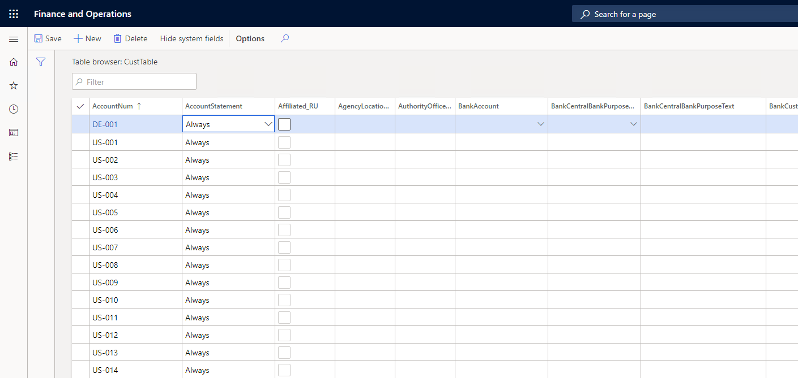

# Open Table Browser

## 1. Select the table or view you wish to browse the data for and select "Open table browser"

## 2. The table browser form is displayed with the data of the selected table or view

