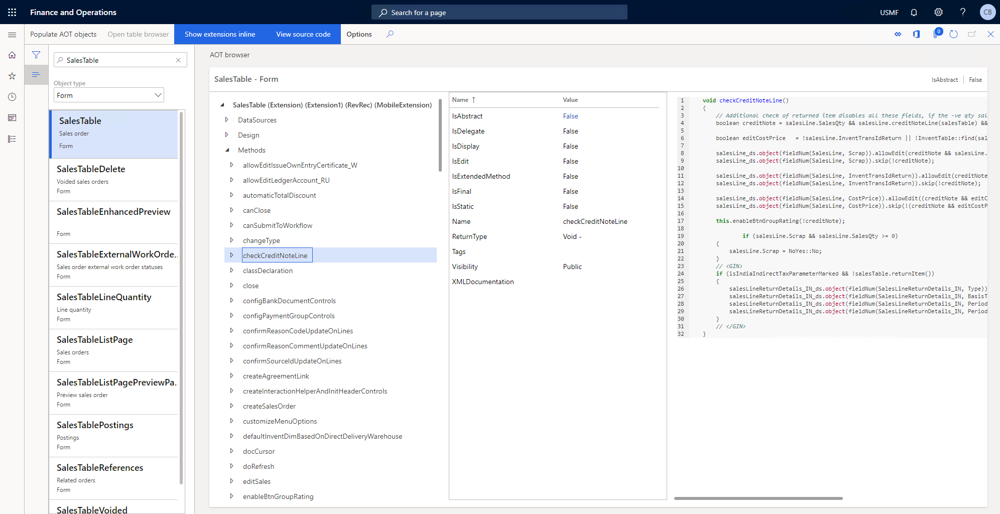
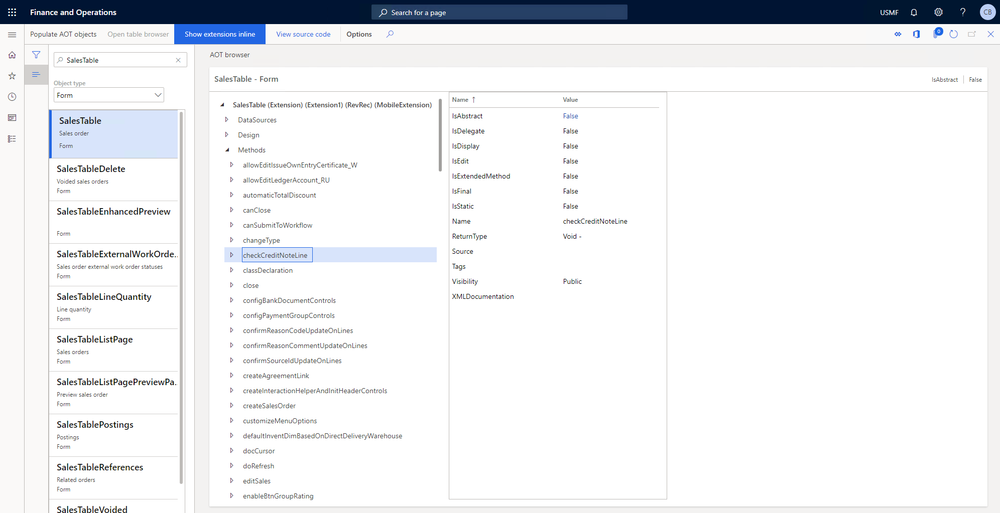

# View Source Code

At the top of the AOT Browser form is a toggle button enabling the ability to view the source code. Enabling this button is only supported in environments that contain source code, such as Development or Demo OneBoxes.

This feature uses a disk based metadata provider that reads the source code directly from the source XML files in the metadata directory. When disabled, the AOT browser will use a runtime based metadata provider which reads from the DLLs. In the case of objects where the code does not exist (even on a development machine), for exmple ISV product delivered as a deployable package, the AOT Browser will revert to the runtime provider.

The code highlighting is provided by the open source [PygmentSharp.Core](https://github.com/akatakritos/PygmentSharp) project.

## Enabled

## Disabled

